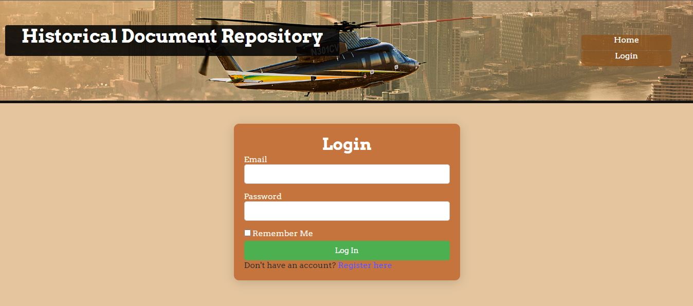
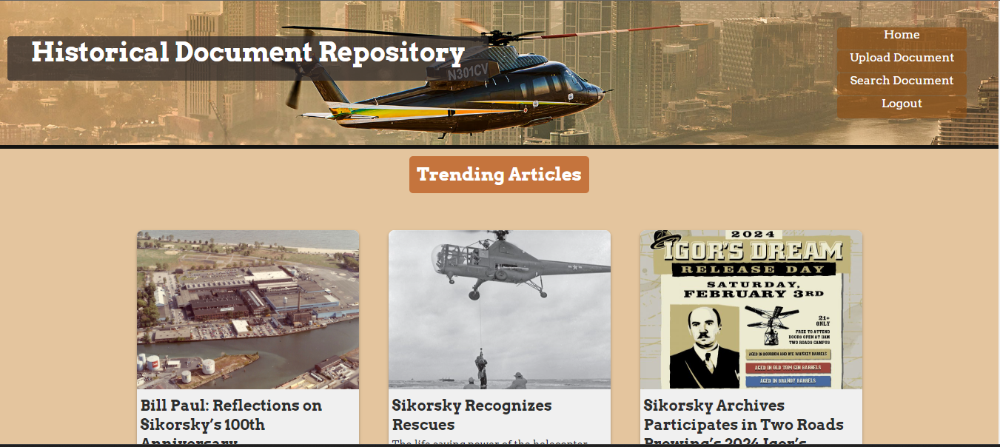
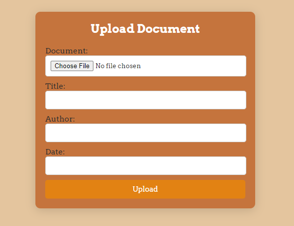
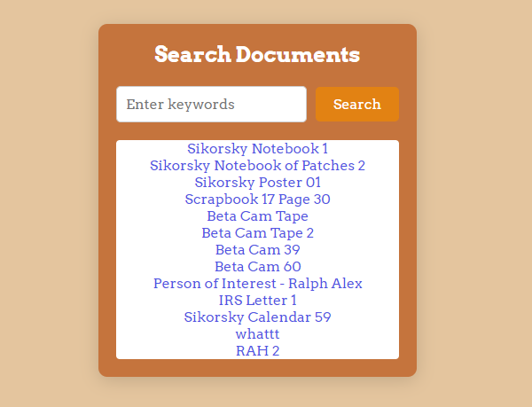
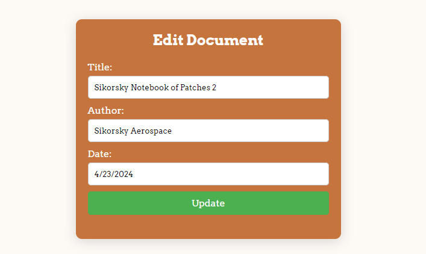
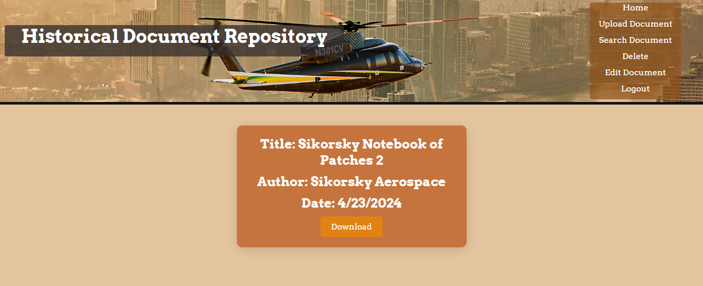

# Historical Documents Repository

## Overview

The Historical Documents Repository is a digital archive designed to store, manage, and facilitate access to historical documents such as letters, speeches, videos, and images. Users can upload, search, view, edit metadata, and download documents. This application adheres to the Model-View-Controller (MVC) paradigm, ensuring a clean separation of concerns for enhanced maintainability and scalability.

## Table of Contents

- [Overview](#overview)
- [Motivation](#motivation)
- [Features](#features)
- [Objectives](#objectives)
- [Architecture](#architecture)
- [Technology Stack](#technology-stack)
- [Images](#images)
- [Data Management](#data-management)
- [Project Prioritization](#project-prioritization)
- [Showcasing Skills and Methodologies](#showcasing-skills-and-methodologies)
- [Lessons Learned](#lessons-learned)
- [Disclaimer](#disclaimer)

## Motivation

The purpose of the Historical Documents Repository is to provide a centralized platform for storing and accessing historical documents for educational and research purposes. The project aims to preserve valuable historical information and make it easily accessible to users worldwide. This initiative was driven by the need for an organized digital archive that allows for efficient document management, retrieval, and dissemination.

## Features

1. **Document Upload**
    - Form-based document upload with metadata entry.
    - Secure storage of document files and metadata.

2. **Search Functionality**
    - Keyword-based search for quick document retrieval.
    - Category-based filtering for targeted searches.

3. **Document Viewing and Downloading**
    - Easy viewing of search results.
    - Direct downloading of documents.

4. **Edit Metadata**
    - User-friendly interface for editing document metadata.
    - Immediate reflection of metadata updates.

5. **Delete Documents**
    - Comprehensive document deletion, including metadata removal.

## Objectives

- Provide a centralized platform for storing and retrieving historical documents.
- Facilitate easy management and access to documents for educational and research purposes.
- Implement robust search functionality for efficient document location.

## Architecture

### Model-View-Controller (MVC) Paradigm

- **Model**: Manages data and business logic, including document storage, retrieval, updating, and deletion.
- **View**: Handles the presentation layer, displaying documents and metadata.
- **Controller**: Manages user input, processes requests, and renders the final output.

## Technology Stack

- **Frontend**: HTML, CSS, JavaScript
- **Backend**: Flask (Python micro web framework)
- **Database**: SQLAlchemy ORM with SQLite

## Images

## Data Management

- **Metadata Storage**: Managed using SQLAlchemy ORM for seamless database interaction.
- **Document Storage**: Documents are stored in server folders, organized by category or upload date.
- **Database Management**: SQLAlchemy interfaces with a relational database to store and manage metadata efficiently, supporting complex queries and enhancing performance.

## Project Prioritization

In developing the Historical Documents Repository, the following priorities were established:

1. **Core Functionality**: Ensuring that document upload, search, and retrieval were fully functional.
2. **User Interface**: Developing an intuitive and user-friendly interface.
3. **Security**: Implementing secure storage and handling of documents and metadata.
4. **Scalability**: Designing the architecture to handle a growing number of documents and users.

Certain advanced features, such as collaborative editing and version control, were not tackled in this phase due to time constraints and the need to focus on core functionality. These features are planned for future iterations.

## Showcasing Skills and Methodologies

This project demonstrates a variety of skills and methodologies, including:

- **MVC Architecture**: Implementing a clean separation of concerns for better maintainability.
- **Flask Framework**: Utilizing Flask for backend development to handle requests and manage the application.
- **SQLAlchemy ORM**: Managing database interactions seamlessly.
- **Frontend Development**: Creating a responsive and intuitive user interface with HTML, CSS, and JavaScript.

## Lessons Learned

Throughout the development of this project, several lessons were learned:

- **Importance of Planning**: Detailed planning at the outset is crucial for a project's success.
- **User Feedback**: Early and continuous user feedback helps in refining the application.
- **Error Handling**: Implementing robust error handling ensures a smoother user experience.

## Problems Faced

- **Data Integrity**: Ensuring data integrity during concurrent uploads was challenging. This was mitigated by implementing transaction management and database locks.
- **Search Optimization**: Optimizing search functionality to handle large datasets efficiently required significant effort. Indexing and query optimization techniques were employed to enhance performance.
- **Scalability Concerns**: Initial designs did not fully account for future scalability. Refactoring and architectural adjustments were necessary to address this issue.

## Disclaimer

This project cannot be executed due to the inclusion of confidential student and organizational information. Sensitive files and data were removed prior to upload to ensure privacy.

---

Feel free to reach out for more information or if you have any questions regarding the Historical Documents Repository.
